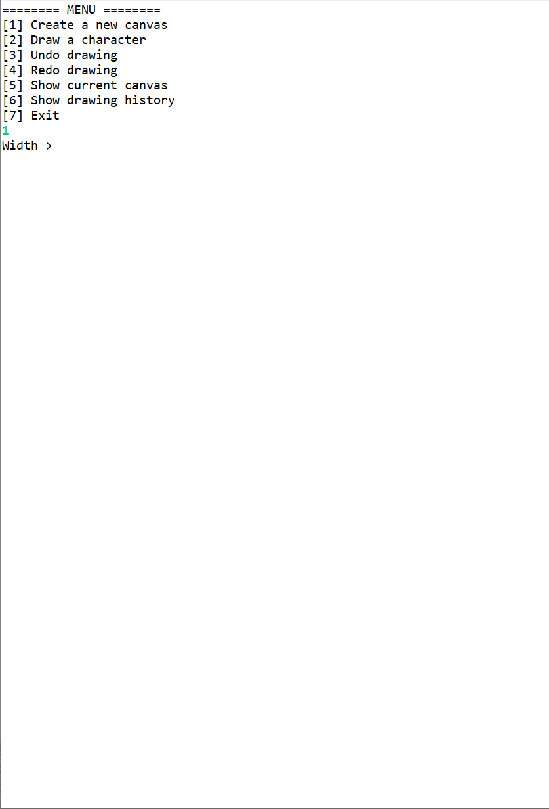

# ASCII-Art

**ASCII-Art** is an project assignment at UW-Madison CS300 course to help understand and conceptualize the idea of Stack and Queue implementation. In this assignment, you will draw some ASCII art pictures. You will have a canvas consisting of a grid of characters. In order to maintain a more useful drawing program, you will also maintain several stacks to enable an UNDO and REDO function.

    

Author: **[Ajmain Naqib](mailto:naqib@wisc.edu)**

Course: CS300, Fall 2018    Lecturer's Name: Gary Dahl

Time spent: **4.2** hours spent in total

## Project Introduction

The following **required** functionality is completed:

* [X] CREATE A DRAWINGSTACK IMPLEMENTATION
* [X] SCREATE THE DRAWING CHANGE CLASS
* [X] CREATE A CANVAS
* [X] THE ASCII ART CLASS

Optional: 
* [] Add an option to save a Canvas and create a stack of Canvases to hold these saved Canvases. Add an option to “animate” your ASCII art by printing each of these saved Canvases in turn. (If you set this up correctly, you can get a flipbook-like animation effect.) Notice that this requires you to make a stack of a different type–you could either make a CanvasStack implementation, or modify your program to use a generic Stack implementation instead.
* []  Extend the DrawingChange class in some way to allow changes beyond individual character shifts. Can you maintain backwards-compatibility so that your Driver and Canvas can work with both new and old DrawingChanges?

More information about this project can be found [here.](http://cs300-www.cs.wisc.edu/wp/index.php/2018/10/30/p08-ascii-art/) 

## Video Walkthrough

Here's a walkthrough of implemented functionality:

GIF created with [LiceCap](http://www.cockos.com/licecap/).

## Notes

## License

    Copyright [2018] [Ajmain Naqib]

